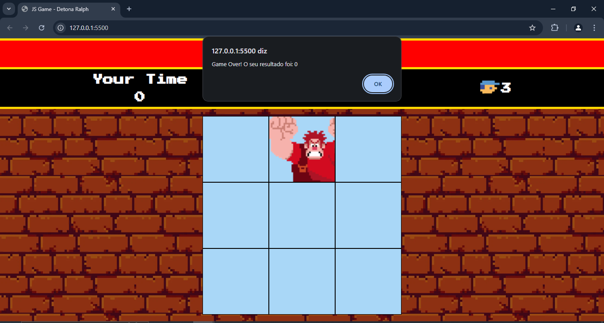
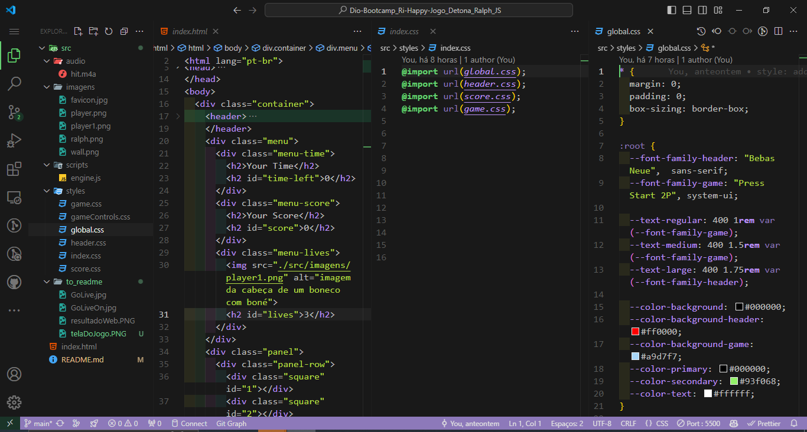
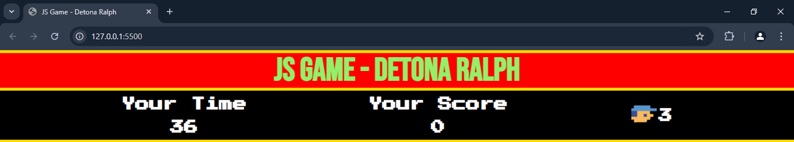

# Desenvolvimento do Jogo Detona Ralph

Desafio prático do Bootcamp da Ri Happy, para desenvolver um cópia do jogo detona Ralph.

## Página estática de Portifólio DEV pessoal 

### 📜 Sobre o Projeto

Este projeto consiste em desenvolver uma cópia do jogo para a plataforma Wii, conhecido como Detona Ralph.  Neste desenvolvimento, iremos aplicar os conceitos estudados de HTML:5, CSS e iniciar o aprendizado do Javascript, para dar ação interatividade à uma página ou jogo.

### 🔗 Links Úteis

- 

- 

### ✅ Status do Projeto

**Em Desenvolvimento**

### 🎥 Demonstração

#### Tela do Jogo

  

#### Tela do código

  

### 🧩 Desafio

O desafio proposto neste projeto foi criar uma cópia do jogo Detona Ralph, aplicando a interatividade do jogador com a aplicação do que foi aprendido na utilização do javascript.

### 📝 Requisitos da Aplicação

| Item  | Descrição                                                                       |
|-------|---------------------------------------------------------------------------------|
|  1    | A página deve ser desenvolvida em HTML, CSS e Javascript                        |
|  2    | Modelagem do layout, formatos, tipografias, cores e organização padrão da aula. |
|  2.1  | Opcional: Modelagem de modo livre.                                              |

### 🚀 Plano do Projeto

No desenvolvimento deste jogo, foram aplicados os seguintes conceitos:

| Item  | Descrição                                   |
|-------|---------------------------------------------|
|  1    | HTML                                        |
|  2    | CSS                                         |
|  3    | Javascript                                  |

### 🛠 Tecnologias Utilizadas

- **Visual Studio Code**
- **HTML**
- **CSS**
- **Javascript**
- **Documentação**
- **ChatGpt**

### 💡 Reflexões

Desenvolver este projeto foi mais um passo no meu desenvolvimento na arte da programação, proporcionando um aprofundamento nas práticas de desenvolvimento web. Foi possível explorar os conceitos básicos do HTML, a  organização do CSS e a interatividade do Javascript, além de aprender e iniciar o desenvolvimento uma nova forma do pensamento logico e sobre a importância de uma estruturação inteligente para facilitar a manutenção futura das aplicações.

### 📦 Como Executar o Projeto

1. Clone o repositório:
   
   git clone https://github.com/ricardo-werner/Dio-Bootcamp_Ri-Happy-Jogo_Detona_Ralph_JS.git

3. Abra o projeto no Visual Studio Code e ative o Go Live:
    
   

     
   

   

     
   

4. Visualize o resultado na página web:

   

     
   

### 🙋‍♂️ Autor
Ricardo Werner 
Dev em Desenvolvimento
